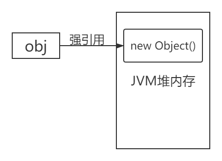
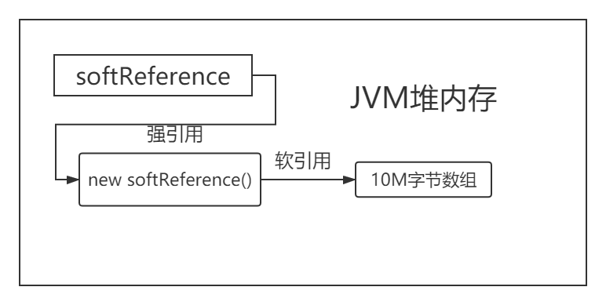
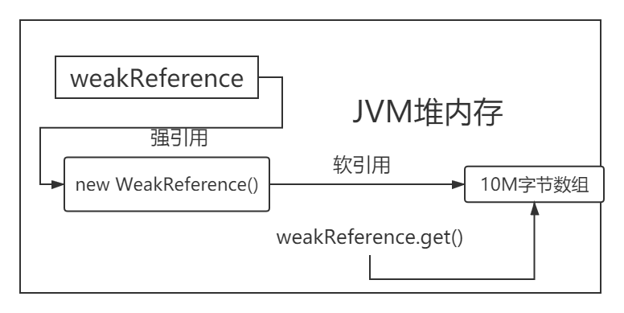
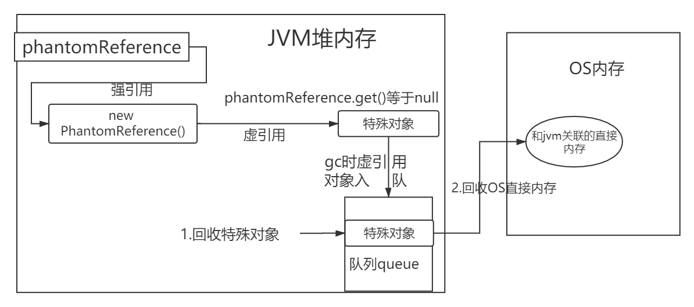

#java中四种引用类型（强软弱虚）
## 强引用 StrongReference
当我们使用 new 这个关键字创建对象时创建出来的对象就是强引用(new出来对象为强引用)  如Object obj = new Object()
这个obj就是一个强引用了，如果一个对象具有强引用。垃圾回收器就不会回收有强引用的对象。如当jvm内存不足时，具备强引用的对象，
虚拟机宁可会抛出OutOfMemoryError(内存空间不足)，使程序终止，也不会靠垃圾回收器去回收该对象来解决内存。
```java
    Object obj=new Object();//这里的obj就是强引用
    System.gc();//让垃圾回收期工作
    Thread.sleep(2000);
    System.out.println(object);//强引用，即使垃圾回收甚至OOM都不会回收强引用指向的内存
```


## 软引用 SoftReference

被引用对象可有可无，内存充足时候，垃圾回收器不会回收软引用指向的对象，如果内存不足时gc直接清除软引用指向的对象。
```java
        //软引用指向了10M堆内存
               SoftReference<byte[]> softReference=new SoftReference(new Byte[1024*1024*10]);
               System.out.println(softReference.get());
               System.gc();
               Thread.sleep(500);
               System.out.println(softReference.get());//内存充足，软引用对象保留
               //强引用指向了15M堆内存。－Xmx:20。堆内存最大
               byte[] b=new byte[1024*1024*15];//20-15=5，堆内存不足
               System.out.println("内存不足 "+softReference.get());
```

### 应用场景
软引用可用来实现内存敏感的高速缓存。软引用可有可无的特性和缓存特性一致。缓存使用原则，
如果缓存中有就从缓存获取，如果没有就从数据库中获取，缓存的存在是为了加快计算速度，如果因为缓存导致了内存不足进而整个程序崩溃，那就得不偿失了。

## 弱引用WeakReference（ThreadLocal中应用）
弱引用的对象拥有更短暂的生命周期。在垃圾回收器线程扫描它所管辖的内存区域的过程中，
gc一旦发现了只具有弱引用的对象，不管当前内存空间足够与否，都会回收它的内存。

```java
        WeakReference<byte[]> weakReference=new WeakReference(new Byte[1024*1024*10]);
        //weakReference.get()获取指向字节数组的若引用
        System.out.println(weakReference.get()); //正常打印Byte数组。Byte;@1540e19d
        System.gc(); //gc发现弱引用，立刻回收
        Thread.sleep(5000);
        System.out.println(weakReference.get());//不能打印弱引用数组 null
        System.out.println(weakReference);//weakReference这是一个强引用，可以打印。WeakReference@677327b6

```


应用场景：ThreadLocal

## 虚引用
“虚引用”顾名思义，就是形同虚设。它的get()方法无论何时返回的都只会是null。
所以单独使用虚引用时，没有什么意义，需要和引用队列ReferenceQueue类联合使用。
当执行Java GC时如果一个对象只有虚引用，就会把这个对象加入到与之关联的ReferenceQueue中。
```java
           static List list=new ArrayList();
           static ReferenceQueue queue=new ReferenceQueue();
           public static void main(String[] args) throws  Exception{
               PhantomReference phantomReference=new PhantomReference(new OverFinalizeObject(), queue);
               new Thread(()->{
                   while (true){
                       list.add(new byte[1024*1024]);//不断添加数据，导致堆内存溢出，发生gc,回收虚引用
                       try {
                           Thread.sleep(1000);
                       }catch (Exception e){
                           e.printStackTrace();
                       }
                       System.out.println("获取虚幻引用"+phantomReference.get());//由于是虚引用，每次都是null
                   }
               }).start();
       
               new Thread(()->{
                   while (true){//不断检测是否有虚引用对象加入到回收队列中
                       Reference<? extends OverFinalizeObject> poll=queue.poll();
                       if (poll!=null){//被立即回收的虚引用会首先加入到队列中
                            1。回收虚引用·
                           System.out.println("这是虚引用回收的东西"+poll);//
                            2。回收虚引用对象OverFinalizeObject关联的os直接内存
                       }
                   }
               }).start();
       
               try {
                   Thread.sleep(500);
               }catch (Exception e){
                   e.printStackTrace();
               }
       
           }

class OverFinalizeObject{
    protected void finalize() throws Throwable {
        System.out.println("我是OverFinalizeObject对象，即将被gc回收");
    }
}
```
第一个线程往集合里面塞数据，随着数据越来越多，肯定会发生GC。 
第二个线程死循环，从queue里面拿数据，如果拿出来的数据不是null，就打印出来。从运行结果可以看到：
当**发生GC，虚引用就会被回收，并且会把回收的通知放到ReferenceQueue中**。
虚引用有什么用呢？在NIO中，就运用了虚引用管理堆外内存.



### 引用场景
主要是java堆内存和OS直接内存进行数据交互时候，为了JVM释放堆内存中对象后，与该对象关联的OS直接内存空间（比如网络数据流之类的）也能安全释放。
在**NIO中，就运用了虚引用管理堆外内存.**(设计NIO知识，后期整理)


#ThreadLocal

[参考hollis大神的面试几乎必问](https://www.hollischuang.com/archives/4859 "参考hollis大神的")
[马士兵讲解:强软弱虚＋threadlocal](https://www.bilibili.com/video/BV1fA411b7SX?from=search&seid=16512905782384903835)
