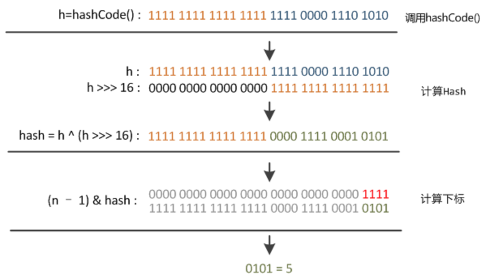
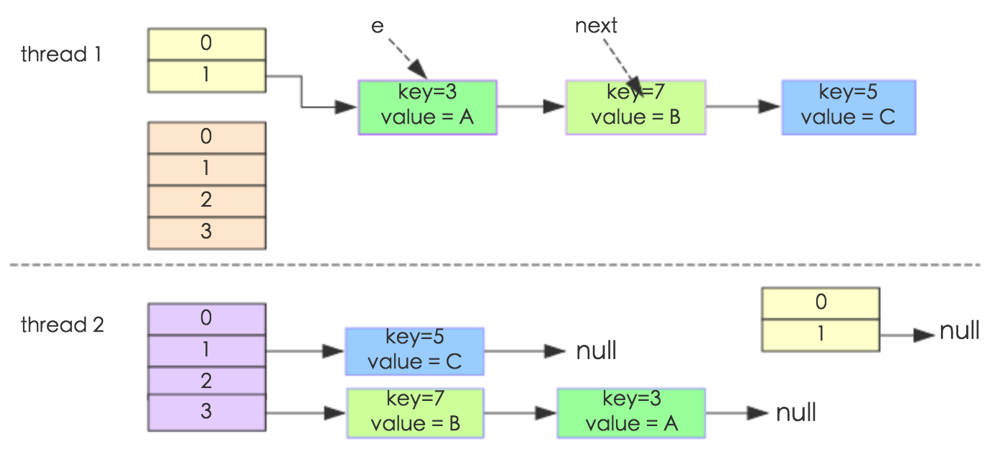
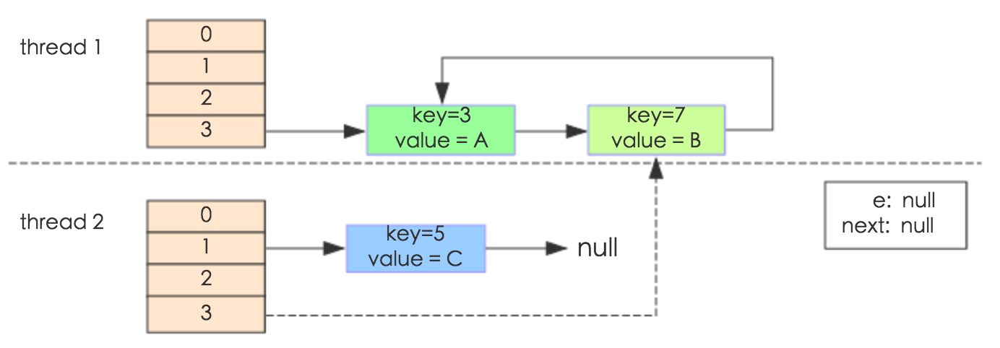

## hashmap中hash算法确定哈希桶位置

### jdk1.8中哈希算法
不管增加、删除、查找键值对，定位到哈希桶数组的位置都是很关键的第一步。前面说过HashMap的数据结构是数组和链表的结合，
所以我们当然希望这个HashMap里面的元素位置尽量分布均匀些，尽量使得每个位置上的元素数量只有一个，那么当我们用hash算法求得这个位置的时候，
马上就可以知道对应位置的元素就是我们要的，不用遍历链表，大大优化了查询的效率。HashMap定位数组索引位置，
直接决定了hash方法的离散性能。先看看源码的实现(方法一+方法二):
```java
方法一：
static final int hash(Object key) {   //jdk1.8 
     int h;
     // h = key.hashCode() 为第一步 取hashCode值
     // h ^ (h >>> 16)  为第二步 高位参与运算
     return (key == null) ? 0 : (h = key.hashCode()) ^ (h >>> 16);
}
方法二：
static int indexFor(int h, int length) {  //jdk1.7的源码，jdk1.8没有这个方法，但是实现原理一样的
     return h & (length-1);  //第三步 取模运算
}
```
**Hash算法本质上就是三步**
1. 取key的hashCode值(key.hashCode())
2. 高位运算h = key.hashCode() ^ (h >>> 16) (**高低位同时参与运算降低冲突**)
3. 取模运算。h & (length-1)（**&运算效率高于%**）

对于任意给定的对象，只要它的hashCode()返回值相同,程序调用方法一所计算得到的Hash码值总是相同的.
好的hash算法的目的计算出来的index下标位置尽可能分散均匀一些。一般可以对数组长度取余%arrayLength获得index.
但是jdk设计者并没有这样做。原因有两个

一、直接取余hash算法冲突高。任何key的hashcode只用到了低位定位index,冲突可能性比较高。因此jdk设计者
通过把hashcode的高低16位做异或运算。目的：hash算法冲突率低、分散均匀.

二、直接取余%操作效率低下。hashcode % length和hashcode&(length-1)“低位掩码”计算最终结果一样，但是
&比取余%运算速度更快。



**拓展**：第二步骤高低位参与运算又称为“扰动函数”，最后我们来看一下Peter Lawley的一篇专栏文章《An introduction to optimising a hashing strategy》里的的一个实验：
他随机选取了352个字符串，在他们散列值完全没有冲突的前提下，对它们做低位掩码(低位与运算)，取数组下标。


结果显示，当HashMap数组长度为512的时候，也就是用掩码取低9位的时候，在没有扰动函数的情况下，发生了103次碰撞，
接近30%。而在使用了扰动函数之后只有92次碰撞。碰撞减少了将近10%。看来扰动函数确实还是有功效的。
Java 8觉得扰动做一次就够了，做4次的话，多了可能边际效用也不大，所谓为了效率考虑就改成一次了。

JDK 源码中 HashMap 的 hash 方法原理是什么？
https://www.zhihu.com/question/20733617

### jdk1.7中哈希算法

```java
哈希算法
final int hash(Object k) {
        int h = hashSeed;
        if (0 != h && k instanceof String) {
            return sun.misc.Hashing.stringHash32((String) k);
        }
        h ^= k.hashCode();
        h ^= (h >>> 20) ^ (h >>> 12);//四次扰动函数,jdk1.8只要一次扰动。高低16异或运算
        return h ^ (h >>> 7) ^ (h >>> 4);
    }
static int indexFor(int h, int length) {
        return h & (length-1); //定位到桶的索引位置
//这也正好解释了为什么HashMap的数组长度要取2的整次幂。因为这样（数组长度-1）正好相当于一个低位掩码”。
    }
```
这段代码是为了对key的hashCode进行扰动计算，防止不同hashCode的高位不同但低位相同导致的hash冲突。
简单点说，就是为了把高位的特征和低位的特征组合起来，降低哈希冲突的概率，也就是说，
尽量做到任何一位的变化都能对最终得到的结果产生影响。举个例子来说，我们现在想向一个HashMap中put一个K-V对，
Key的值为“hollischuang”，经过简单的获取hashcode后，得到的值为“1011000110101110011111010011011”，
如果当前HashTable的大小为16，即在不进行扰动计算的情况下，他最终得到的index结果值为11。
由于15的二进制扩展到32位为“00000000000000000000000000001111”，所以，
一个数字在和他进行按位与操作的时候，前28位无论是什么，计算结果都一样（因为0和任何数做与，结果都为0）。如下图所示。

可以看到，后面的两个hashcode经过位运算之后得到的值也是11 ，虽然我们不知道哪个key的hashcode是上面例子
中的那两个，但是肯定存在这样的key，这就产生了冲突。
那么，接下来，我看看一下经过**扰动算法**最终的计算结果会如何。

从上面图中可以看到，之前会产生冲突的两个hashcode，经过扰动计算之后，最终得到的index的值不一样了，这就很好的避免了冲突。


## hashmap扩容
###  jdk1.7hashmap扩容
扩容(resize)就是重新计算容量，向HashMap对象里不停的添加元素，而HashMap对象内部的数组无法装载更多的元素时，
对象就需要扩大数组的长度，以便能装入更多的元素。当然Java里的数组是无法自动扩容的，方法是使用一个新的数组代替已有的容量小的数组，
就像我们用一个小桶装水，如果想装更多的水，就得换大水桶。我们分析下resize的源码，鉴于JDK1.8融入了红黑树，
较复杂，为了便于理解我们仍然使用JDK1.7的代码，好理解一些，本质上区别不大，具体区别后文再说。

```java
void resize(int newCapacity) {   //传入新的容量  
     Entry[] oldTable = table;    //引用扩容前的Entry数组  
     int oldCapacity = oldTable.length;           
     if (oldCapacity == MAXIMUM_CAPACITY) {  //扩容前的数组大小如果已经达到最大(2^30)了  
         threshold = Integer.MAX_VALUE; //修改阈值为int的最大值(2^31-1)，这样以后就不会扩容了  
         return;  
     }  
   
     Entry[] newTable = new Entry[newCapacity];  //初始化一个新的Entry数组  
    transfer(newTable);                         //！！将数据转移到新的Entry数组里  
    table = newTable;                           //HashMap的table属性引用新的Entry数组  
    threshold = (int)(newCapacity * loadFactor);//修改阈值  
}
```

这里就是使用一个容量更大的数组来代替已有的容量小的数组，transfer()方法将原有Entry数组的元素拷贝到新的Entry数组里。
```java
void transfer(Entry[] newTable) {  
    Entry[] src = table;                   //src引用了旧的Entry数组  
    int newCapacity = newTable.length;  
    for (int j = 0; j < src.length; j++) { //遍历旧的Entry数组  
        Entry<K,V> e = src[j];             //取得旧Entry数组的每个元素  
        if (e != null) {  
            //src[j]与上面的一条链表脱钩。
            src[j] = null;//释放旧Entry数组的对象引用（for循环后，旧的Entry数组不再引用任何对象）  
             do {  
                 Entry<K,V> next = e.next;  
                int i = indexFor(e.hash, newCapacity); //！！重新计算每个元素在数组中的位置  
                e.next = newTable[i]; // 转移的节点的尾指针，指向newTable[i]所指向的第一个节点（头插法），开始newTable[i]
                //如果newTable[i]==null的话，那么e.next指向的就是null
                newTable[i] = e;      //将元素放在数组上 ,数组newTable[i]位置的引用指向刚刚的节点e（头插法） 
                e = next;             //访问下一个Entry链上的元素  
            } while (e != null);  //while循环遍历链表上结点，并且转移到新的数组中
        }  
    }  
}
```
### hashmap并发扩容导致的死循环（jdk1.7头插法）
多线程使用场景中，应该尽量避免使用线程不安全的HashMap，而使用线程安全的ConcurrentHashMap
```java
public class HashMapInfiniteLoop {    
               
            private static HashMap<Integer,String> map = new HashMap<Integer,String>(2，0.75f);   
            public static void main(String[] args) {    
                map.put(5，"C");   
           
                newThread("Thread1") {    
                    public void run() {    
                        map.put(7,"B");   
                        System.out.println(map);   
                    };   
                }.start();   
                newThread("Thread2") {    
                    public void run() {    
                        map.put(3, "A);    
                        System.out.println(map);   
                    };   
                }.start();         
            }   
        }
```
其中，map初始化为一个长度为2的数组，loadFactor=0.75，threshold=2*0.75=1，也就是说当put第二个key的时候，map就需要进行resize。 
通过设置断点让线程1和线程2同时debug到transfer方法的首行。注意此时两个线程已经成功添加数据。放开thread1的断点至transfer方法
的“Entry next = e.next;” 这一行；然后放开线程2的的断点，让线程2进行resize。结果如下图。 

注意，Thread1的 e 指向了key(3)，而next指向了key(7)，其在线程二rehash后，指向了线程二重组后的链表。

线程一被调度回来执行，先是执行 newTalbe[i] = e， 然后是e = next，导致了e指向了key(7)，而下一次循环的next = e.next导致
了next指向了key(3)。


e.next = newTable[i] 导致 key(3).next 指向了 key(7)。注意：此时的key(7).next 已经指向了key(3)， 环形链表就这样出现了。

于是，当我们用线程一调用map.get(11)时，悲剧就出现了——Infinite Loop。

### jdk1.8 hashmap尾插法避免死循环

### 如何检测到死循环
链表如何确认存在循环，这里说了双指针

## 面试题
HashMap的哈希算法是怎么实现的，为什么要这样实现
为什么链表长度超过8才升级成红黑树，直接用红黑树合适吗？
## [美团技术点评hashmap1.8](https://www.cnblogs.com/xiarongjin/p/8310691.html)


