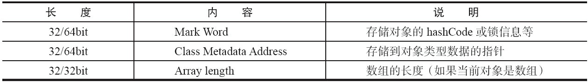
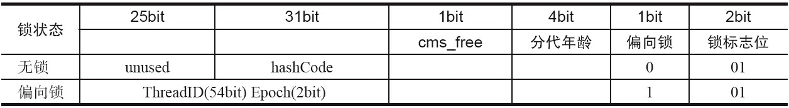
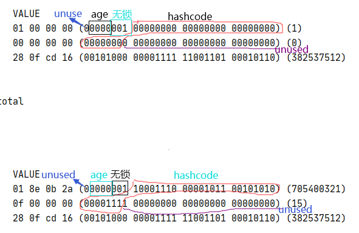
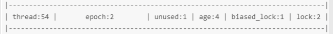
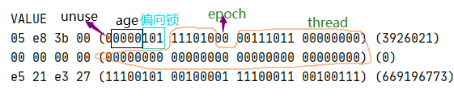
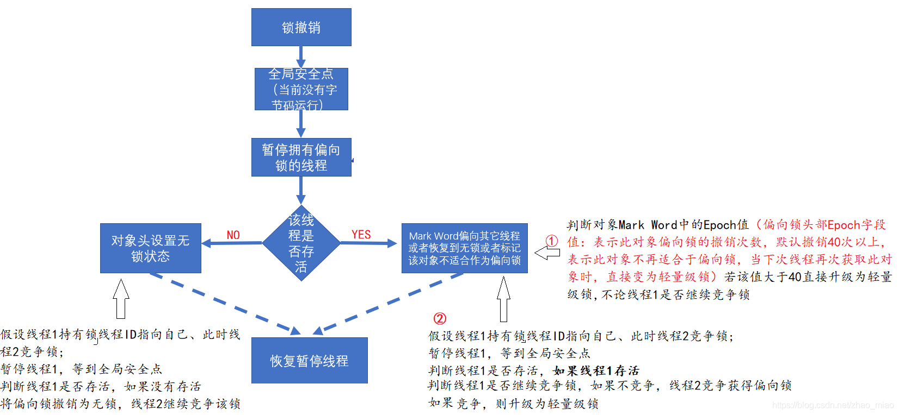
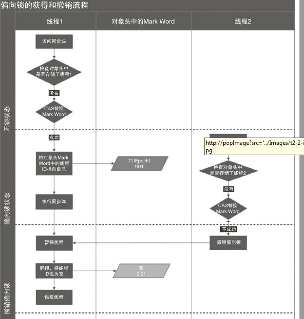

# synchronized概述
> 多线程并发编程中synchronized一直是元老级角色，很多人都会称呼它为重量级锁。jdk1.6之前，如果用synchronzied进行同步的话，会直接进入到重量级锁，一次加锁就会进行用户态，内核态，用户态的切换。jdk1.6及以后版本（加锁不一定进入到内核态），引入了偏向所和轻量级锁，因此减少了锁的获得和释放性能开销。

## synchronized的三种用法
·对于普通同步方法，锁是当前实例对象。
```java
public synchronized void show (){
}
```
·对于静态同步方法，锁是当前类的Class对象。

```java
public  class SynClass {
	 public static synchronized void show (){}
}
```
·对于同步方法块，锁是Synchonized括号里配置的对象。
```java
Object lock = new Object();

public void show(){
		monitorenter指令
		synchronized(lock){
		}
		monitorexit指令
	}
```
任何对象都与一个monitor关联，代码块同步是使用monitorenter和monitorexit字节码指令实现的。


# 从打印对象头开始
一开始学习java时候，我们就知道java是面向对象的语言，而且万物都可以看作对象。我们常用的new Object()就可以创造一个对象，那么到底这个对象在内存中怎么表示的，如果你了解计算机组成原理的话应该知道，内存中存放的都是二进制数据，也就是说如果这个对象被new出来，那么在内存中一定是以二进制的形式进行存放的。
```java
public static void main(String[] args) {
        System.out.println(ClassLayout.parseInstance(new Object()).toPrintable());
    }
	java.lang.Object object internals:
 OFFSET  SIZE   TYPE DESCRIPTION                               VALUE
      0     4        (object header)                           01 00 00 00 (00000001 00000000 00000000 00000000) (1)
      4     4        (object header)                           00 00 00 00 (00000000 00000000 00000000 00000000) (0)
      8     4        (object header)                           28 0f f7 16 (00101000 00001111 11110111 00010110) (385290024)
     12     4        (loss due to the next object alignment)
Instance size: 16 bytes
Space losses: 0 bytes internal + 4 bytes external = 4 bytes total
<dependency>
            <groupId>org.openjdk.jol</groupId>
            <artifactId>jol-core</artifactId>
            <version>0.9</version>
</dependency>
```
## 对象头的组成

```cpp
class oopDesc {
  friend class VMStructs;
  friend class JVMCIVMStructs;
 private:
  volatile markWord _mark;
  union _metadata {
    Klass*      _klass;
    narrowKlass _compressed_klass;
  } _metadata;
```
64位虚拟机下，markword分布结构（占用8个字节）


# 锁的升级过程
## 无锁状态
```java
public class PrintObjectHead {
    public static void main(String[] args) {
        Object obj=new Object();
        System.out.println("计算hashcode之前的对象头");
        System.out.println(ClassLayout.parseInstance(obj).toPrintable());
        System.out.println(Integer.toHexString(obj.hashCode()));
        System.out.println("计算hashcode之后的对象头"); // hashcode=f2a0b8e
        System.out.println(ClassLayout.parseInstance(obj).toPrintable());
    }
}

```

## 偏向锁
所谓的偏向，就是偏心，即锁会偏向于当前已经占有锁的线程。

### 为什么引入偏向锁？
一个加synchronized锁的代码在多数情况下并不存在竞争，而且同时多次由同一个线程获得。比如一个购物网站，深夜凌晨的访问量可能就是个位数，为了提高单个线程获得锁和释放锁的效率因此引入了偏向锁（单个线程获取锁不会在用户态，内核态，用户态之间切换）。
### 偏向锁如何加锁
```java
Object obj=new Object();
        //开启虚拟机偏向锁 -XX:BiasedLockingStartupDelay=0
        System.out.println("无锁状态\n"+ClassLayout.parseInstance(obj).toPrintable()+"\n 线程ID"+
        Long.toHexString(Thread.currentThread().getId()));
        synchronized (obj){
            System.out.println("无锁状态\n"+ClassLayout.parseInstance(obj).toPrintable()+"\n 线程ID"+
                    Long.toHexString(Thread.currentThread().getId())+ "  hashcode"+Integer.toHexString(obj.hashCode()));
            Thread.sleep(100000);
        }
无锁状态对象头
 OFFSET  SIZE   TYPE DESCRIPTION                               VALUE
      0     4        (object header)                           05 00 00 00 (00000101 00000000 00000000 00000000) (5)
      4     4        (object header)                           00 00 00 00 (00000000 00000000 00000000 00000000) (0)
      8     4        (object header)                           e5 21 e3 27 (11100101 00100001 11100011 00100111) (669196773)
```
这里无锁状态下，锁标志却是101（偏向锁的标志），因为我们开启了-XX:BiasedLockingStartupDelay=0，偏向锁0延迟，任何对象创建出来
就是偏向锁状态，不再是无锁状态（001）。如果开启偏向锁延迟的话，新创建的对象的锁状态标志是001。0偏向锁延迟的条件下，即使对象不加synchronized锁，那么
也是出于偏向锁状态。

一个线程访问同步块并获取锁时，会在对象头和栈帧中的锁记录里存储锁偏向的线程ID，以后该线程在进入和退出
同步块时不需要进行CAS操作来加锁和解锁，只需简单地测试一下对象头的Mark Word里是否
存储着指向当前线程的偏向锁。因此，这个偏向锁是可重入锁，同一个线程可以多次synchronized(同一个object)

-XX:BiasedLockingStartupDelay=0:零延迟条件下的偏向锁，a线程加锁过程如下。新对象obj锁特征就是101，如果a发现对象头内线程id是指向当前线程a线程。
则可以直接重入该锁。如果a线程发现对象头线程id不是指向自己，则通过cas(无锁状态下ThreadId占用的位置二进制数据,myThreadId)进行竞争尝试该偏向锁指向自己a。

-XX:BiasedLockingStartupDelay ！=0。偏向锁由延迟的条件下，对象初始化时候锁标志是01，偏向锁标志0，此时线程会通过cas方式加锁设置偏向锁标志=1，
并且偏向锁线程id是自己线程id。

因此偏向锁非常适合同一个线程多次加锁，或者多个线程交替加锁。因此偏向锁的加锁检查等等操作只是进行cas等操作，不需要切换到内核态，因此相比于重量锁耗时非常短。

### 偏向锁释放
偏向锁使用了一种等到竞争出现才释放锁的机制，所以当其他线程尝试竞争偏向锁时，
持有偏向锁的线程才会释放锁。

### 偏向锁关闭

如果你确定应用程序里所有的锁通常情况下处于竞争状态，可以通过JVM参数关闭偏向锁：-XX:-
UseBiasedLocking=false，那么程序默认会进入轻量级锁状态


## 轻量级锁
## 重量级锁