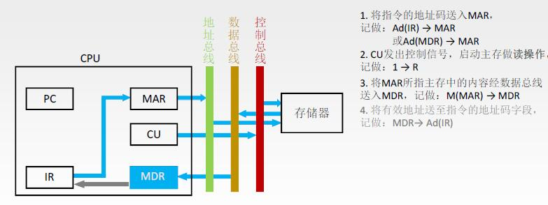
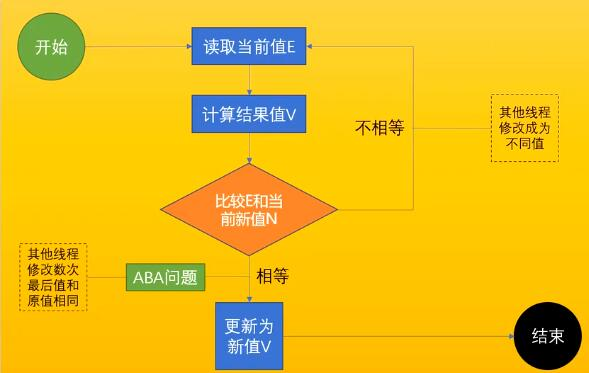

# 什么是原子操作

不可被中断的一个或一系列操作

## 处理器如何实现原子操作

一般通过缓存cache或总线加锁的方式实现多处理器之间原子操作。

### 总线加锁（重量级锁）

学过计算机组成原理的话应该知道，cpu的指令周期数据流中的间址周期中，cpu和存储器之间的数据交互
必须要通过总线（地址、数据、控制），比如cpu从存贮器地址xx0001中取出数据过程是，由mar地址传输到地址总线，CU控制单元发出控制信号开始读取。
读取的数据经过数据总线传输到MDR中，因此cpu和存储器的数据交互必须经过总线。多cpu情况下，为了保证对存储器中某个共享变量的修改的原子性比如i++，cpu1执行i++操作时候
使用总线锁LOCK#信号发送到总线上，其他cpu2如果想和存储器进行数据交互i++请求都会被阻塞住，因此可以保证cpu1执行i++操作的原子性。

缺点：这是一把重锁，虽然可以实现原子操作，但是如果其他处理器访问的不是i++那块存储器也会被阻塞住，很明显不合理。




### 缓存加锁保障原子性（轻量级锁）

所谓“缓存锁定”是指内存区域如果被缓存在处理器的缓存
行中，并且在Lock操作期间被锁定，那么当它执行锁操作回写到内存时，处理器不在总线上声
言LOCK＃信号，而是修改内部的内存地址，并允许它的缓存一致性机制来保证操作的原子
性，因为缓存一致性机制会阻止同时修改由两个以上处理器缓存的内存区域数据。


## java如何实现原子操作

主要两种方式 加锁synchronized和循环CAS方式

### 加锁实现原子操作

锁机制保证了只有获得锁的线程才能够操作锁定的内存区域。
```java
synchronized(obj){
    to do 1
    to do 2
    ....
}
```
### 循环cas

JVM中CAS使用了cpu的cmpxchg指令实现，不断循环执行cas直到成功为止。



#### cas ABA问题
如果一个值原来是A，变成了B，又变成了A，那么使用CAS进行检查时会发现它
的值没有发生变化，但是实际上却变化了。解决： 使用版本号 1A->2B>3A

#### cas循环时间开销大

自旋CAS如果长时间不成功，会给CPU带来非常大的执行开销。
**更深入的话，JVM插入pause指令，防止消耗五段流水部件，以及防止内存访问冲突引起cpu流水线清空（计算机组成原理空指令、五段流水访存冲突）。**

#### cas只能保证一个变量原子

对多个共享变量操作时，循环CAS就无法保证操作的原子性。解决：有两个共享变量i＝2，j=a，合并一下ij=2a，然后用CAS来操作ij。